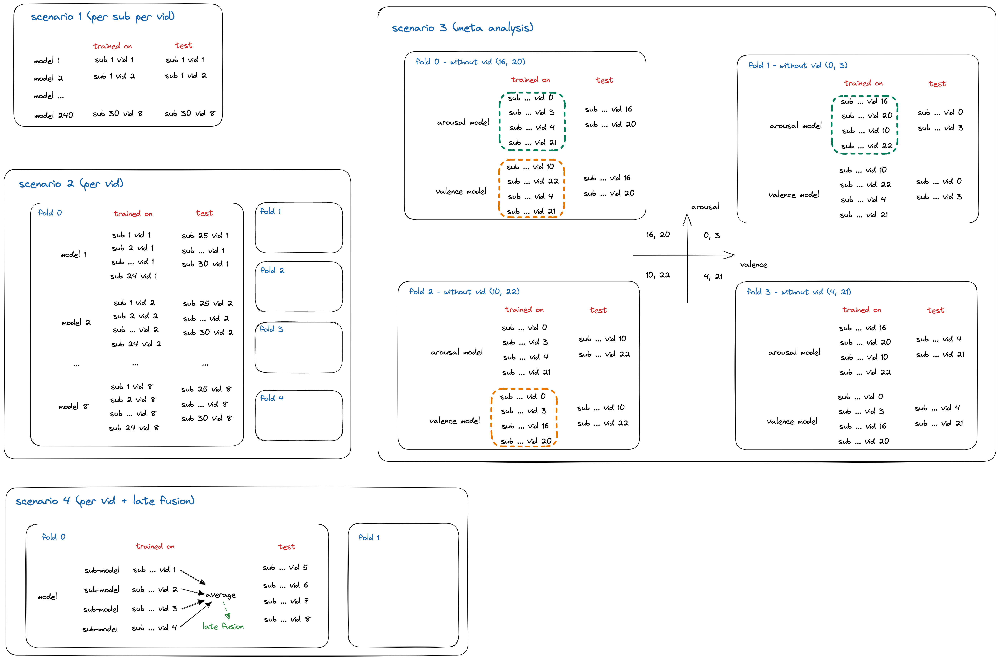

# Models

> Training different models for each scenarios.

For each scenario, we use the same model architecture, autogluon, to train the models.
According to each scenario's task, we use different training strategy.

(The suffix number is the identifier of target PC.)

